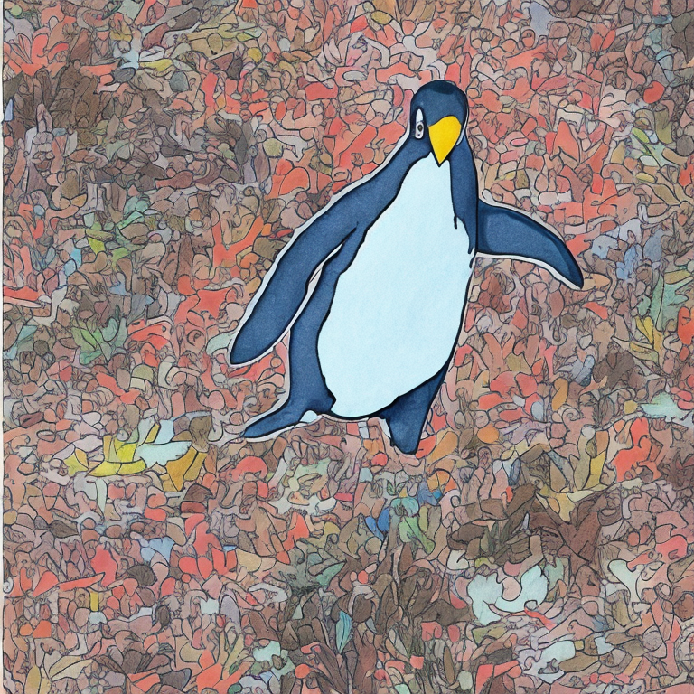
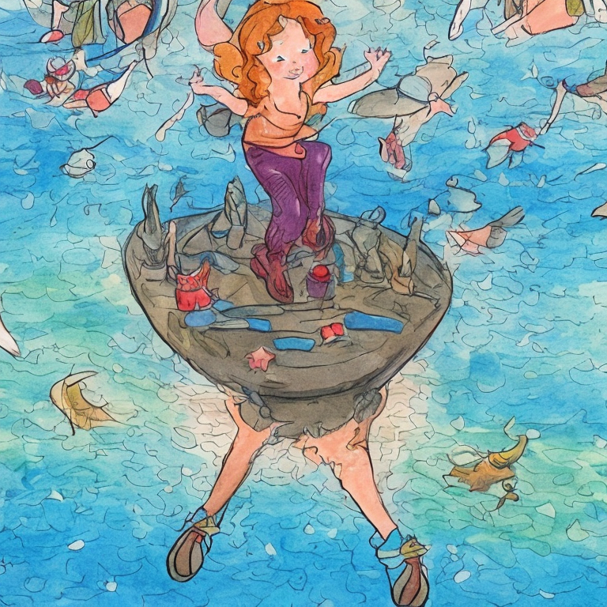
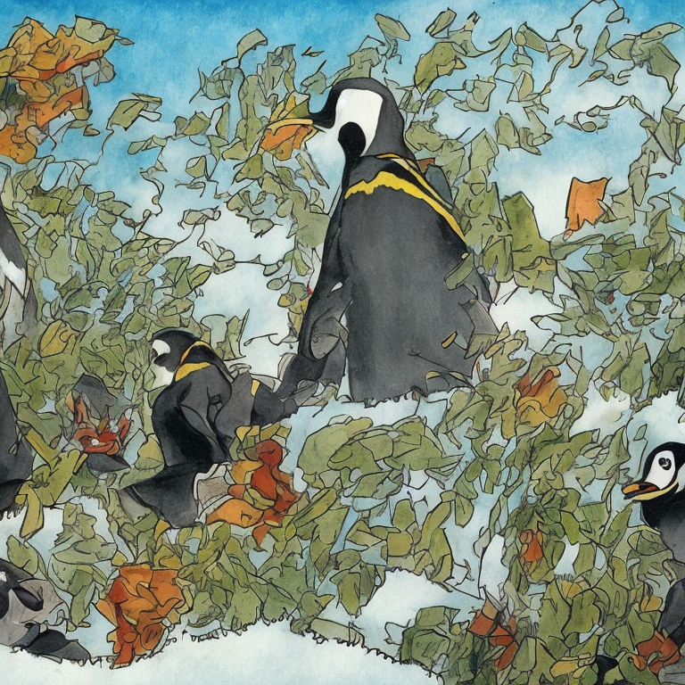
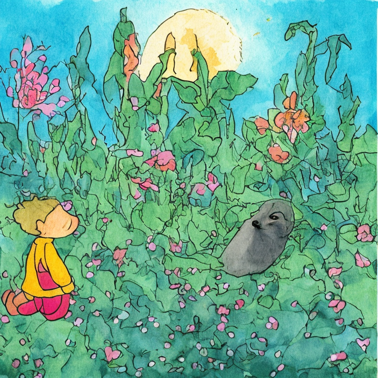
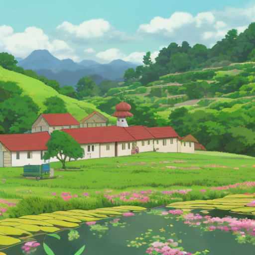
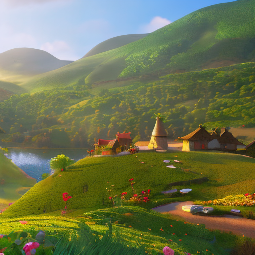
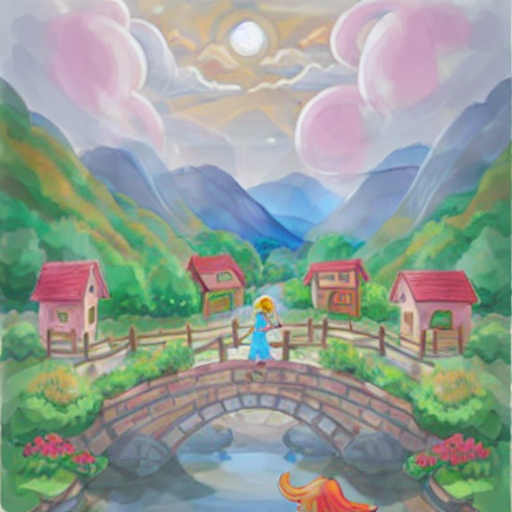
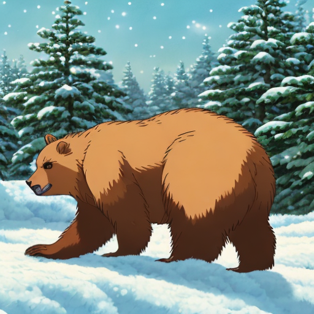
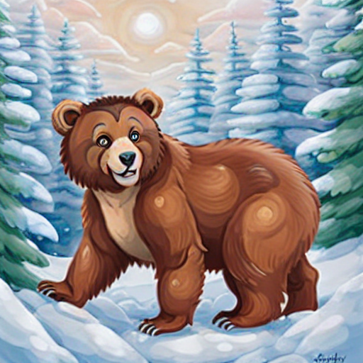

# eerie

> **Text Summarization and Image Generation — illustrating children's stories.** A research pipeline that reads a children's story, condenses it with a **fine-tuned BART summarizer**, and renders one storybook illustration per sentence with a **fine-tuned Stable Diffusion 2.1** model, then optionally restyles the panels with an instruction-driven editor. The importable [`eerie/`](eerie/) package runs this thesis pipeline end-to-end behind a single `run_pipeline`.

[](https://colab.research.google.com/github/beysa/eerie/blob/master/eerie-demo.ipynb)

**Senior thesis (2023) — Yıldız Technical University, Computer Engineering.**
Authors: **Yaren Yıldırım** (17011019) · **Beyza Nur Sezgin** (17011045).
Advisor: **Lect. Furkan Çakmak**. Inspired by the generative-art work of **Refik Anadol**.

Two models were **fine-tuned for this thesis and published on the Hugging Face Hub**:

- **[`ektvho/bart-cnn`](https://huggingface.co/ektvho/bart-cnn)** — the BART summarizer.
- **[`ektvho/sd-vist`](https://huggingface.co/ektvho/sd-vist)** — the Stable Diffusion 2.1 image generator.

---

## Core vs. Extensions

This repository is an **umbrella**: the thesis is the core; later exploratory work is clearly labelled as extensions. Read this box first so nothing is mistaken for the thesis.

> ### 🎓 Core — the thesis (2023)
> The verified, published research pipeline, exposed as `eerie.run_pipeline`. **Fine-tuned models only.**
> - **Summarization:** `ektvho/bart-cnn` — BART fine-tuned from `ccdv/lsg-bart-base-4096-booksum` (a 4096-token LSG-BART) on `cnn_dailymail`.
> - **Image generation:** `ektvho/sd-vist` — **Stable Diffusion 2.1** fine-tuned on the **VIST** (Visual Storytelling) dataset, native **768×768**.
> - **Style transfer:** `timbrooks/instruct-pix2pix` (off-the-shelf, optional).
> - Pipeline: *story → fine-tuned BART summary → one SD2.1 image per sentence → optional InstructPix2Pix style.*
>
> ### 🧪 Extensions — post-thesis exploration (NOT the thesis)
> Built **after** the thesis to probe related ideas. These use **off-the-shelf SD1.5**, never the fine-tuned thesis models.
> - **[`extensions/multi_style/`](extensions/multi_style)** — swap an off-the-shelf SD1.5 art-style checkpoint (Ghibli / modern-animation / watercolor) per run. Entry point `run_multi_style`.
> - **[`extensions/character-consistency/`](extensions/character-consistency)** — a ComfyUI **IPAdapter** workflow (SD1.5 DreamShaper) with a real before/after, addressing the cross-panel consistency the thesis pipeline does not solve.

**Why the split.** The thesis fine-tuned BART and SD2.1 — that is the contribution and the core of this repo (`eerie.run_pipeline`). The SD1.5 multi-style package and the ComfyUI IPAdapter demo are **labelled extensions**: they do *not* use the fine-tuned models and are never presented as the thesis.

## Published models

The two models fine-tuned for the thesis, both verified on the Hugging Face Hub. **These are the thesis core.**

| Model | Base | Dataset | Role | Link |
|-------|------|---------|------|------|
| **`ektvho/bart-cnn`** | [`ccdv/lsg-bart-base-4096-booksum`](https://huggingface.co/ccdv/lsg-bart-base-4096-booksum) — an LSG-BART with a 4096-token long context | `cnn_dailymail` | Summarize the story before illustration | [🤗](https://huggingface.co/ektvho/bart-cnn) |
| **`ektvho/sd-vist`** | Stable Diffusion **2.1** | **VIST** (Visual Storytelling) | Generate one storybook illustration per sentence (768×768) | [🤗](https://huggingface.co/ektvho/sd-vist) |

The `ektvho/bart-cnn` tokenizer is `ccdv/lsg-bart-base-4096-booksum`, which uses LSG (Local-Sparse-Global) attention and therefore loads with `trust_remote_code=True`.

## Quickstart — the thesis pipeline

The [`eerie/`](eerie/) package runs the **fine-tuned** thesis pipeline end to end:

```text
story  ──►  ektvho/bart-cnn (summarize)  ──►  ektvho/sd-vist (one SD2.1 image / sentence)  ──►  instruct-pix2pix (optional style)
```

```python
from eerie import run_pipeline

# Thesis pipeline: fine-tuned BART summary -> one ektvho/sd-vist image per sentence.
result = run_pipeline(
    "Once upon a time, at the edge of a vast frozen sea, there lived a curious penguin named Pip. ...",
    summarize=True,   # thesis default: condense with the fine-tuned LSG-BART first
    style=None,        # optional InstructPix2Pix restyle instruction (e.g. "watercolor")
    seed=42,
)
result["scenes"]        # List[str] — the (summarized) sentences that were illustrated
result["panel_paths"]   # List[str] — output/panel_0.png, output/panel_1.png, ...
result["styled_paths"]  # List[str] — output/panel_i_styled_<style>.png (empty if style=None)
```

Import is GPU-free (models load lazily on first use). A CUDA GPU is required to generate; the fine-tuned models download from the Hub automatically.

### Thesis gallery *(run-verified on an NVIDIA A40)*

The real `ektvho/sd-vist` illustrations of **"Pip's Whirlwind Adventure"** (a curious penguin) — the story summarized by `ektvho/bart-cnn`, then each summary sentence rendered at 768×768 by the fine-tuned SD2.1 model:

<p align="center">
  
  
  
  
</p>

<sub>Generated end-to-end by <code>eerie.run_pipeline(story, summarize=True)</code> on an NVIDIA A40 — `ektvho/bart-cnn` (LSG-BART) summary → `ektvho/sd-vist` (SD2.1, 768×768) per sentence. These are the fine-tuned thesis models' own outputs (a soft VIST-trained watercolor look), not an off-the-shelf checkpoint.</sub>

## Extensions

Post-thesis exploration. Both use **off-the-shelf SD1.5** and are independent of the fine-tuned thesis models above.

### 1. Multi-style exploration (SD1.5) — [`extensions/multi_style/`](extensions/multi_style)

A small importable pipeline that illustrates every sentence of a story by **swapping an off-the-shelf SD1.5 art-style checkpoint** (no LoRA, IPAdapter, or ControlNet):

```python
from extensions.multi_style import run_multi_style

result = run_multi_style(
    "Once upon a time there was a small village by the sea. ...",
    art_style="watercolor",   # ghibli | modern_animation | watercolor (off-the-shelf SD1.5)
    summarize=True,
    style="picasso",          # optional InstructPix2Pix restyle (None -> skipped)
    seed=42,
)
```

| `art_style` | Backing SD1.5 model (off-the-shelf) |
|-------------|-------------------------------------|
| `ghibli` (default) | [`nitrosocke/Ghibli-Diffusion`](https://huggingface.co/nitrosocke/Ghibli-Diffusion) |
| `modern_animation` | [`nitrosocke/mo-di-diffusion`](https://huggingface.co/nitrosocke/mo-di-diffusion) — a community "Disney-like" fine-tune (**not** Pixar / not affiliated) |
| `watercolor` | [`ilee0022/watercolor_stable_diffusion`](https://huggingface.co/ilee0022/watercolor_stable_diffusion) |

**Style-exploration gallery** *(run-verified — SD1.5 extension, NOT the thesis).* The same opening scene of two stories across all three SD1.5 styles — same story, same pinned seed, only the checkpoint changes:

| Story | `ghibli` | `modern_animation` | `watercolor` |
|:--|:--:|:--:|:--:|
| **Lily** |  |  |  |
| **Biscuit** |  |  |  |

<sub>Off-the-shelf SD1.5, 512×512, per-panel pinned seed — a post-thesis style exploration, not the fine-tuned `ektvho/sd-vist`.</sub>

### 2. Character consistency (ComfyUI + IPAdapter) — [`extensions/character-consistency/`](extensions/character-consistency)

A separate ComfyUI workflow tackling the one problem neither the thesis pipeline nor the SD1.5 package solves: **keeping the same character looking the same across panels.** It uses **IPAdapter** on off-the-shelf **SD1.5 DreamShaper** to inject a character reference, with a real **before/after** (panels at IPAdapter weight `0.0` vs `0.8`). Run-verified on an A40 — see its [README](extensions/character-consistency/README.md) and committed `outputs/`.

## Limitations

Honest scope, kept separate per layer:

- **Thesis pipeline — no cross-panel character consistency.** Each summary sentence is illustrated independently by `ektvho/sd-vist`; a character may not look the same across panels. This is exactly what the IPAdapter extension explores.
- **Summarizer is a news summarizer.** `ektvho/bart-cnn` was fine-tuned on `cnn_dailymail`; on children's prose its abstractive summaries can be terse or slightly repetitive — that is the real model's behaviour, shown honestly.
- **Extensions are not the thesis.** `extensions/multi_style` and `extensions/character-consistency` use off-the-shelf **SD1.5**, never the fine-tuned `ektvho/sd-vist`.
- **No quantitative metrics are claimed in this README** (no ROUGE / FID / CLIP). Results are shown qualitatively; any numbers belong to the thesis report.
- **GPU required;** image generation is SD2.1 (thesis) or SD1.5 (extensions). No SDXL.

## Documentation

- **[`docs/REPORT.md`](docs/REPORT.md)** — the full technical report (models, datasets, method, results).
- **[`docs/poster.html`](docs/poster.html)** — a one-page research/portfolio poster (open in a browser; print to PDF).
- **`eerie-demo.ipynb`** — the Colab demo of the thesis pipeline.

## Setup

```bash
git clone https://github.com/beysa/eerie
cd eerie
pip install -r requirements.txt           # thesis core + extensions share this pinned stack
```

The fine-tuned thesis models (`ektvho/bart-cnn`, `ektvho/sd-vist`) and the off-the-shelf SD1.5 extension checkpoints download from the Hub on first use. `requirements.txt` pins a GPU-verified stack (run end-to-end on an NVIDIA A40, torch 2.4 / CUDA 12.4; hard constraints `transformers<5` and `numpy<2`). The character-consistency extension has its own ComfyUI setup under [`extensions/character-consistency/`](extensions/character-consistency).
