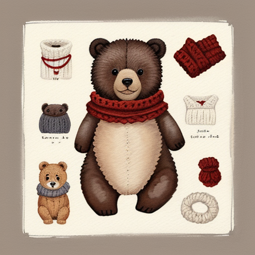
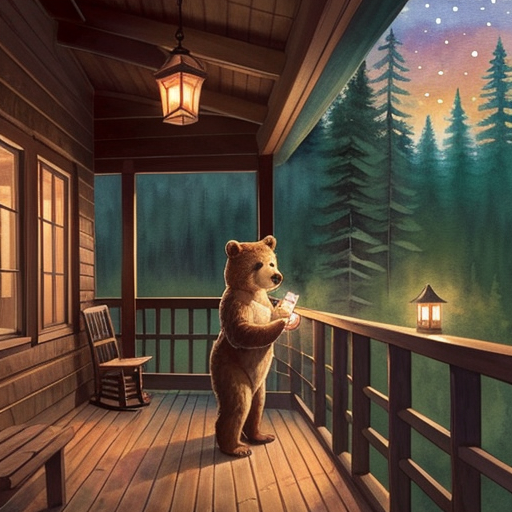
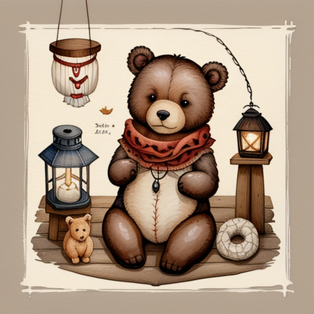
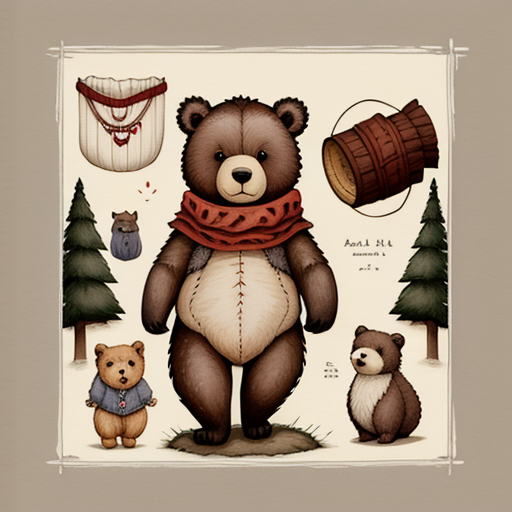
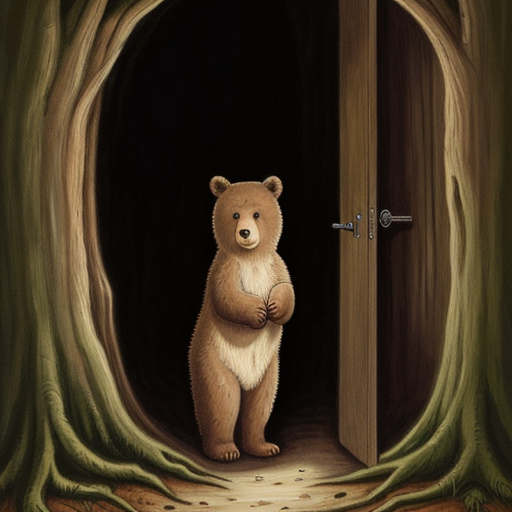
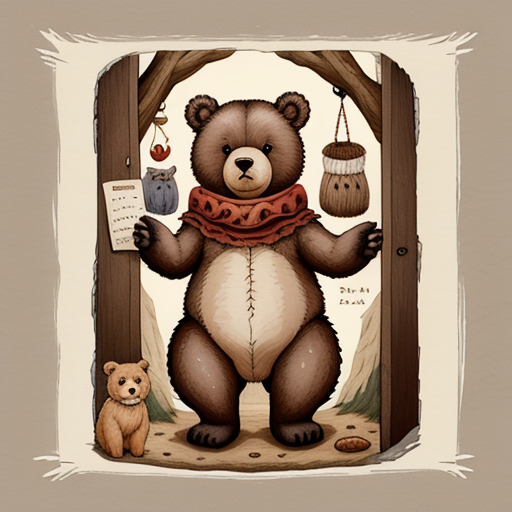
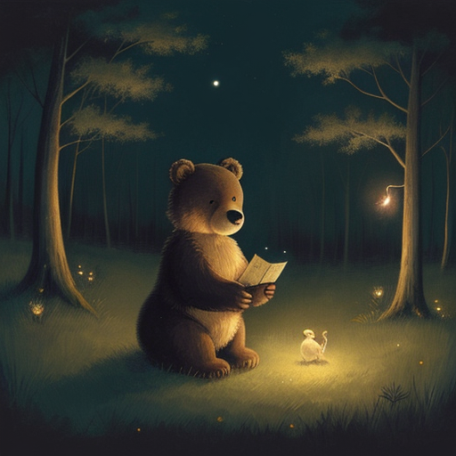
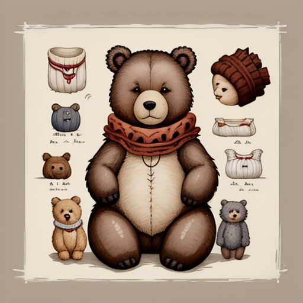

# Biscuit the Bear Cub — story-to-comic (character consistency on SD1.5)

> A small, **honest** ComfyUI demo: keep one drawn character looking like the
> same character across a 4-panel story, using IPAdapter on Stable Diffusion
> 1.5. The headline is a controlled A/B — same seed, same prompts, same model,
> only the IPAdapter weight changes (`0.0` vs `0.8`). ControlNet (Canny) is an
> **optional secondary** experiment, not part of the headline claim.

The whole pipeline talks to a stock [ComfyUI](https://github.com/comfyanonymous/ComfyUI)
server over its HTTP API (reached via an SSH tunnel to a RunPod GPU pod). One
script — [`run.py`](run.py) — generates a character reference once, then renders
each scene twice and saves the results to `outputs/before/` and `outputs/after/`.

## Why this repo exists (relationship to `eerie`)

This is a focused companion to my thesis project
[**`eerie`**](https://github.com/beysa/eerie), which turns a children's story
into one illustrated panel per sentence with a Stable Diffusion 1.5 art-style
checkpoint. `eerie` is deliberately honest about one gap, quoting its own
*Future work* section:

> Panels are generated independently. **There is no cross-panel character
> consistency** … the most important missing piece … an IPAdapter or
> ControlNet-based approach so the same character keeps a stable appearance
> from panel to panel.

**This repo is a self-contained prototype of exactly that missing piece.** It
isn't wired back into the `eerie` package; it's the smallest standalone artifact
that demonstrates the mechanism `eerie` lacks. The cast even overlaps on
purpose — *Biscuit, a bear cub* already appears in `eerie`'s gallery, so you can
compare "same seed, different checkpoint" (what `eerie` shows) against "same
checkpoint, character injected vs. not" (what this shows).

## What it proves

Character consistency on SD1.5 via
[`cubiq/ComfyUI_IPAdapter_plus`](https://github.com/cubiq/ComfyUI_IPAdapter_plus):

1. Generate a single character reference (`character_ref.png`) **once** with a
   plain text-to-image graph (no IPAdapter).
2. For each of 4 fixed scene prompts, render the **same** panel graph **twice**,
   changing exactly **one** variable — the IPAdapter `weight`:
   - `weight = 0.0` → **before**. Per IPAdapter's math a zero weight contributes
     nothing, so this is identical to a vanilla SD1.5 render of the same
     prompt/seed. It is a **real control**, not a strawman.
   - `weight = 0.8` → **after**. The reference character is injected.
3. Seed, prompt, checkpoint, sampler, scheduler, steps, CFG and resolution are
   **identical** across before/after. The only delta is the weight — so the
   difference you see is caused by IPAdapter and nothing else.

This is **not** a cherry-picked gallery. `weight=0.0` is the honest baseline.

### Model stack

| Role | File | ComfyUI folder | Source repo |
|------|------|----------------|-------------|
| Base checkpoint (SD1.5) | `dreamshaper_8.safetensors` | `models/checkpoints/` | [`fofr/comfyui`](https://huggingface.co/fofr/comfyui) (mirror of Lykon's DreamShaper 8, Civitai 4384) |
| IPAdapter (SD1.5) | `ip-adapter-plus_sd15.safetensors` | `models/ipadapter/` | [`h94/IP-Adapter`](https://huggingface.co/h94/IP-Adapter) |
| CLIP-ViT-H image encoder | `CLIP-ViT-H-14-laion2B-s32B-b79K.safetensors` | `models/clip_vision/` | [`h94/IP-Adapter`](https://huggingface.co/h94/IP-Adapter) (renamed from `models/image_encoder/model.safetensors`) |
| ControlNet v1.1 Canny — **optional** | `control_v11p_sd15_canny_fp16.safetensors` | `models/controlnet/` | [`comfyanonymous/ControlNet-v1-1_fp16_safetensors`](https://huggingface.co/comfyanonymous/ControlNet-v1-1_fp16_safetensors) |

The panel graph uses the **explicit** `IPAdapterModelLoader` + `CLIPVisionLoader`
pair (rather than `IPAdapterUnifiedLoader`) so the exact pinned files are visible
and auditable in the workflow JSON. Versions — node commits and model sha256 —
are pinned in [`manifest.yaml`](manifest.yaml); the `TO_FILL_ON_POD` placeholders
are filled from the live pod after download (we never invent hashes).

**A note on style.** DreamShaper 8 is a general-purpose community SD1.5
checkpoint; the storybook look comes from the prompts
(`soft painterly children's book art, gentle watercolor and gouache`), not from
a studio model. Nothing here is Pixar, Disney, Ghibli, or affiliated with /
endorsed by any studio.

## Before / After

Four scenes, each rendered twice — left is `weight=0.0` (vanilla SD1.5), right is
`weight=0.8` (IPAdapter injecting `character_ref.png`). Same seed and prompt per
row; only the weight differs.

The character reference (generated once, then fed to IPAdapter for every panel):

<p align="center"></p>

| Scene | Before — `weight 0.0` (vanilla) | After — `weight 0.8` (IPAdapter) |
|:--|:--:|:--:|
| Porch at dusk |  |  |
| Misty forest path |  |  |
| Crooked old door |  |  |
| Moonlit clearing |  |  |

At `weight 0.0` the bear is generic and drifts — lighter fur, no scarf, different style each time. At `weight 0.8` it locks to the reference (dark brown, cream belly, **red knitted scarf**, plush-storybook style) across all four scenes. That consistency is caused by IPAdapter alone — nothing else changes between the columns.

**Honest observation — and why ControlNet is the documented next step.** Because the reference is a full *character sheet*, IPAdapter at `0.8` also pulls its centered framing, so the `after` panels lean toward a character-sheet composition and lose some per-scene staging. That is the textbook reason to pair IPAdapter (identity) with **ControlNet** (composition): wired but optional here (`WITH_CONTROLNET=1`) and the v1.1 step. A lower weight (~0.5–0.6) also trades identity strength for scene adherence.

> These nine images (`outputs/reference|before|after/`) were generated end-to-end on an NVIDIA A40 by `run.py`; the exact model SHA-256s and node commit are pinned in [`manifest.yaml`](manifest.yaml).

The exact prompts, seeds and sampler settings live in
[`prompts/demo_story.yaml`](prompts/demo_story.yaml) (a human-readable mirror of
the constants baked into `run.py`, which is the source of truth).

## Run it on RunPod

No local GPU needed — a laptop with `ssh` and Python 3 is enough.

1. **Launch a ComfyUI pod.** Use an official/community ComfyUI RunPod template.
   Pin the **exact** image tag in [`manifest.yaml`](manifest.yaml) once you pick
   it — never run `:latest`.
2. **Clone this repo on the pod** (into the ComfyUI workspace root, i.e. the
   directory that contains `ComfyUI/`):
   ```bash
   git clone https://github.com/beysa/story-to-comic
   cd story-to-comic
   ```
3. **Install nodes + download models** with the helper. Point `COMFYUI_DIR` at
   your ComfyUI install (defaults to `../ComfyUI`); set `WITH_CONTROLNET=1` to
   also fetch the optional Canny pieces:
   ```bash
   COMFYUI_DIR=/workspace/ComfyUI bash setup.sh
   # optional secondary experiment:
   COMFYUI_DIR=/workspace/ComfyUI WITH_CONTROLNET=1 bash setup.sh
   ```
   Then **restart ComfyUI** so it picks up the new custom nodes, and record the
   real node commit SHAs / model sha256 into `manifest.yaml` (the script prints
   the commands).
4. **Open an SSH tunnel** from your laptop to the pod's ComfyUI port `8188`
   (RunPod gives you the host/port for the pod's SSH endpoint):
   ```bash
   ssh -N -L 8188:127.0.0.1:8188 <user>@<pod-host> -p <pod-ssh-port>
   ```
5. **Run the demo** locally (it talks to `127.0.0.1:8188` through the tunnel):
   ```bash
   pip install -r requirements.txt   # optional; run.py itself is stdlib-only
   python run.py
   ```
   `run.py` generates the reference, uploads it as the IPAdapter input, then
   renders all 4 scenes at `weight=0.0` and `weight=0.8`, saving to
   `outputs/before/` and `outputs/after/`. Override the server with
   `COMFY_HOST=host:port`.

Export the API-format graphs straight from the builders (the script is their
source of truth) with `python run.py --export` → `workflows/reference_api.json`,
`workflows/panel_api.json`.

## Limitations / scope

This is a v1 prototype. What it is, and is not:

- **Single character only.** One reference (`character_ref.png`), one cast
  member (Biscuit). No multi-character scenes, no per-character control.
- **IPAdapter-only headline.** The before/after claim is about IPAdapter and
  nothing else; the single varied parameter is its `weight`.
- **ControlNet (Canny) is optional and secondary.** It's pinned in the manifest
  and fetched only with `WITH_CONTROLNET=1`; it is **not** part of the headline
  A/B (adding it would muddy the single-variable claim). There is no
  ControlNet workflow JSON in v1 — it's reserved as a follow-up experiment.
- **No LLM / story parser.** The 4 scenes and their prompts are fixed by hand in
  `run.py` / `demo_story.yaml`. There is no automatic sentence splitting,
  summarization, or scene-graph extraction (that lives in the `eerie` package,
  separately).
- **Stable Diffusion 1.5 only.** DreamShaper 8 base; no SDXL, no LoRA, no FaceID.
- **Consistency is qualitative.** The proof is the controlled visual A/B plus
  reproducible seeds — there is no FID / CLIP-similarity / human-eval number.
- **Character quality is bounded by the reference.** If the one generated
  reference is weak, every `weight=0.8` panel inherits that weakness.

## License

No license file is included yet. This is a portfolio / thesis-adjacent
demonstration; please contact the author before reuse.
